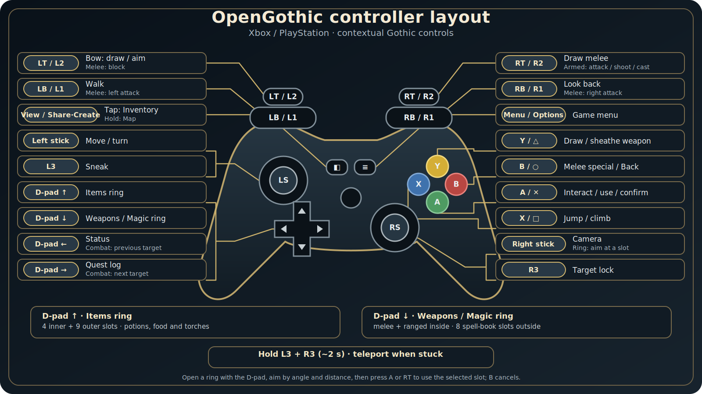

## OpenGothic for iOS

An **unofficial iOS port** of [OpenGothic](https://github.com/Try/OpenGothic) — the open-source
re-implementation of *Gothic II: Night of the Raven*. This fork adds the plumbing to build, sideload,
and play OpenGothic on iPhone/iPad with a Bluetooth controller **or** a full on-screen virtual gamepad.

> ### ⚠️ Work in progress
> This fork is under **active development**. The core loop — gameplay, the on-screen virtual gamepad,
> save/load and haptics — has been **tested and confirmed on a device**, and the hard 30 fps cap is
> lifted (ProMotion). The physical-controller movement response and jump landing are also
> device-confirmed. It is still rough in places and being tuned, so expect bugs. See
> [`ios/TODO.md`](ios/TODO.md) for the current status and remaining gaps.

> ### Credit
> **The entire engine is the work of [Try](https://github.com/Try) and the OpenGothic contributors.**
> OpenGothic and its rendering engine [Tempest](https://github.com/Try/Tempest) are what make this
> possible — this fork only finishes and wires up the iOS path. Please support the upstream project:
> ⭐ [Try/OpenGothic](https://github.com/Try/OpenGothic) · 💬 [Discord](https://discord.gg/G9XvcFQnn6).
> Not affiliated with or endorsed by the original authors; distributed under the same [license](LICENSE).
>
> Controller glyphs are **[Xelu's Free Controller & Keyboard Prompts](https://thoseawesomeguys.com/prompts)**
> by Nicolae "Xelu" Berbece (CC0).

---

### Prerequisites

*Gothic II: Night of the Raven* is required — OpenGothic ships **no** game assets or scripts. You must
legally own the game and supply its data yourself.

Target: iPhone/iPad on **iOS 15+**, arm64. Best on modern GPUs (A-series / M-series). Locked to landscape.

### Install — download & play (no Mac, no build)

No fork, no compiling — a prebuilt **unsigned `.ipa`** is published on every update. Detailed guide:
**[ios/README-ios.md](ios/README-ios.md)**.

1. **Install with SideStore** (recommended). In SideStore: **Sources → +**, paste
   `https://github.com/tryk016/opengothic-ios/releases/download/latest/apps.json`, then install
   OpenGothic. SideStore signs it with your **free Apple ID** and **auto-refreshes the 7-day certificate
   over Wi-Fi** — no manual reinstalling. *(AltStore or Sideloadly also work, using the `.ipa` from the
   [Releases page](https://github.com/tryk016/opengothic-ios/releases/latest).)*
2. **Add your game data.** Copy the `Data/`, `_work/`, and `system/` folders from your own Gothic II
   install into the app's **Documents** folder (Files app on iOS). Launch and play.

Building it yourself (maintainers only): trigger the [`iOS build`](.github/workflows/ios.yml) Action, or use [`ios/build-ios.sh`](ios/build-ios.sh) + Xcode on a Mac — see the guide.

### Controls

Two input modes; the on-screen overlay hides automatically when a controller is connected.

**Bluetooth controller (contextual Gothic scheme — Xbox / PlayStation buttons):**

Text alternative: complete button mapping

| Function | Xbox | PlayStation |
|---|---|---|
| Interact / use / confirm | A | ✕ |
| Melee special / Back | B | ○ |
| Jump / climb | X | □ |
| Draw / sheathe weapon | Y | △ |
| Move / turn | Left stick | Left stick |
| Camera | Right stick | Right stick |
| Draw bow / aim; melee block | LT | L2 |
| Draw melee; attack / shoot / cast | RT | R2 |
| Walk; melee left attack | LB | L1 |
| Look back; melee right attack | RB | R1 |
| Sneak | L3 | L3 |
| Target lock | R3 | R3 |
| Items ring | D-pad ↑ | D-pad ↑ |
| Weapons / Magic ring | D-pad ↓ | D-pad ↓ |
| Status / previous combat target | D-pad ← | D-pad ← |
| Quest log / next combat target | D-pad → | D-pad → |
| Inventory (tap) / Map (hold) | View | Share / Create |
| Game menu | Menu | Options |
| Unstuck teleport | hold L3 + R3 ~2 s | hold L3 + R3 ~2 s |

- **Two separate quick-rings:** D-pad ↑ opens the Items ring (4 inner + 9 outer slots);
  D-pad ↓ opens the Weapons / Magic ring (equipped melee and ranged weapons inside, 8 spell-book
  slots outside). These are two panels, not one combined wheel; D-pad ↑/↓ also switches between them
  while open. Aim by the right-stick angle and distance, press A or RT to use the selected slot, or B
  to cancel. Tiles show real 3D item icons.
- **Automatic contents:** the Items ring fills its 9 outer slots first, then its 4 inner slots, using
  potions, food and torches from the live inventory. A lit torch is included synthetically so it can be
  stowed again. The Weapons / Magic ring is populated from equipped gear and all active spell-book slots 3–10.
- **Contextual combat:** LT blocks in melee and aims a bow; RT attacks, shoots or casts. LB/RB become
  left/right melee attacks and otherwise provide walk/look-back. Outside combat, D-pad ←/→ opens
  character status/the quest log; while target lock is active it selects the previous/next target.
- **Inventory:** LB/RB jumps to the previous/next sorted item category; the sticks and D-pad retain
  normal grid navigation.
- **System buttons:** tap View for the inventory or hold it for ~0.6 s for the map. Menu opens the game
  menu. Quick save/load remains available to the engine through its keyboard commands, but is not
  assigned to the controller.
- **Left-stick response:** the vertical axis keeps Gothic's animation-driven movement with
  press/release hysteresis; the horizontal axis turns proportionally to the deflection. A sloped axial
  guard rejects accidental movement while the
  stick is held mostly sideways (and accidental turning while held mostly forward/back). Returning to
  neutral, opening a ring/UI, disconnecting or resuming the app releases controller-owned actions before
  input can re-arm.
- Config lives in `Documents/Gothic.ini` under `[GAMEPAD]` — `deadZone`, `releaseZone`,
  `crossAxisGuard`, `lookSensitivity`, `invertY`, `triggerThreshold` and `noStuckProtect`.

**On-screen virtual gamepad (no controller):** a full pad is drawn during play — move pad + camera area,
A/B/X/Y, shoulders/triggers, sticks, D-pad, View/Menu — using the Xelu glyphs. It mirrors the physical
pad's contextual mapping and two D-pad quick-rings. Menus and dialogues get on-screen D-pad +
OK/Back/Skip. While a ring is open, only corner controls remain: D-pad ↑/↓ switches the two panels and
B cancels; drag anywhere else and release to use the selected sector.

### iOS configuration

The copied `Documents/system/Gothic.ini` is never overwritten. On the first
successful launch after valid game data is installed, OpenGothic creates a
separate `Documents/Gothic.ini` override if it is absent, with the complete iOS
profile: half-resolution 3D rendering, SSAO off, 512 px shadow maps, quick-save
support and all stable `[GAMEPAD]` defaults (including `crossAxisGuard=0.12`).
An existing root override — even an empty one — is not auto-populated or
replaced.

The generated profile, upgrade note, override priority, optional FPS cap and
diagnostic settings are documented in the
[iOS configuration reference](ios/README-ios.md#ios-configuration).

### Known limitations

- **Still a work in progress** — the core game loop is device-tested, but expect rough edges and
  ongoing tuning (see the notice above and `ios/TODO.md`).
- Save-slot preview thumbnails are not captured on iOS yet (slots show name, date and in-game time, but a
  blank picture).
- Sideload certificate expires weekly (auto-refresh via AltStore/SideStore).
- Mesh shaders are disabled on iOS for GPU compatibility.
- On-screen virtual-pad button layout is a first pass and still needs on-device tuning.
- Some smaller controller-polish items in `ios/TODO.md` are not done yet.

### What this fork adds on top of upstream

- **Build/distribution:** cloud build of an unsigned `.ipa` (`.github/workflows/ios.yml`); `ios/` build
  script, sideload/data guide, and submodule patches (`ios/patches/apply-patches.sh`).
- **Controller:** event-driven GameController snapshots (`game/utils/gamepad.*`), a release-safe,
  context-aware dispatcher with left-stick hysteresis and proportional turning that also drives
  menus/dialogues (`game/ui/gamepadinput.*`), native target lock-on, two concentric-row radial panels
  with 3D item icons (`game/ui/quickring.*`), contextual zGamePad-inspired combat controls, haptics
  (`game/utils/haptics.*`), stuck-protection, and a `[GAMEPAD]` config.
- **On-screen input:** a full virtual gamepad + menu/dialogue/inventory controls with controller glyphs
  (`game/ui/touchinput.*`, `game/ui/padglyph.*`, `assets/controller/`), a complete controller-layout
  screen and a lock-on reticle.
- **iOS lifecycle/robustness:** graceful "data not found" message instead of a crash
  (`game/utils/systemmsg.*`), audio-session setup (`game/utils/audiosession.*`), landscape lock, keep
  the screen awake, Game Mode keys, a save-crash fix, and dialogue voice-over on ≥4 GB devices.
- **Performance & display:** ProMotion unlock + triple-buffered Metal swapchain (lifts the hard 30 fps
  cap), safe-area-aware HUD (nothing hides under the notch / Dynamic Island), configurable shadow
  resolution, and the upscale-based render-scale guide.
---

*For the engine itself — Windows/Linux/macOS builds, features, mods, command-line arguments, graphics
options, and the contribution guide — see the upstream project:*
**[Try/OpenGothic](https://github.com/Try/OpenGothic)**.
