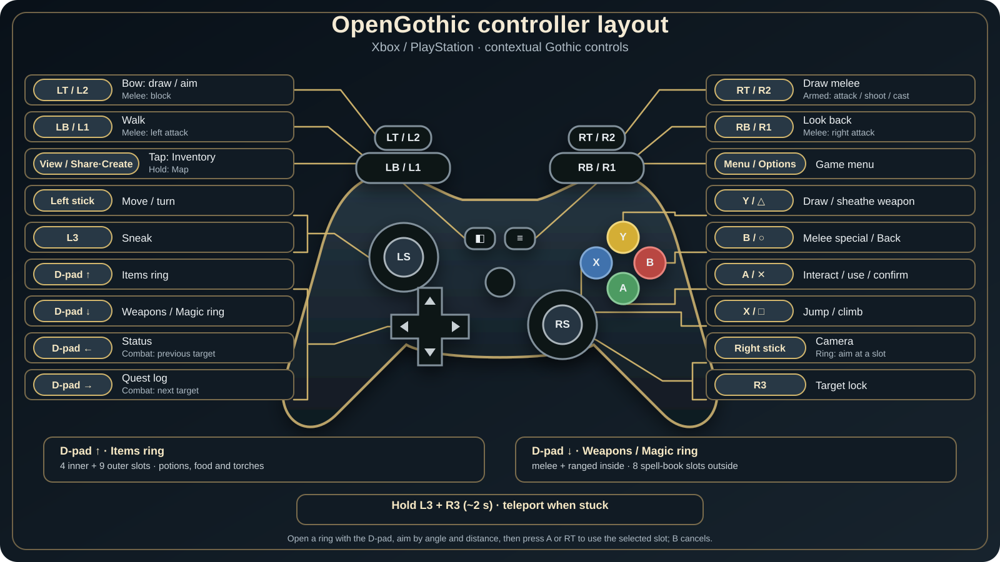

# OpenGothic for iOS

> **Dedicated RendererIOS line.** This repository owns the native iOS/Metal
> renderer and ships from `main`. The Android/Vulkan integration line remains in
> [`tryk016/opengothic-ios`](https://github.com/tryk016/opengothic-ios). Upstream
> changes may be integrated into this repository deliberately, but RendererIOS
> is not merged back into that cross-platform `master`.

An **unofficial iOS port** of [OpenGothic](https://github.com/Try/OpenGothic) — the open-source
re-implementation of *Gothic II: Night of the Raven*. This fork adds the plumbing to build, sideload,
and play OpenGothic on iPhone/iPad with a Bluetooth controller **or** a full on-screen virtual gamepad.

> ### Work in progress
> The native RendererIOS candidate is under active development. Earlier iOS
> gameplay and controller results belong to the previous renderer. This
> candidate requires its own final device, performance and visual acceptance.

> ### Credit
> **The entire engine is the work of [Try](https://github.com/Try) and the OpenGothic contributors.**
> OpenGothic and its rendering engine [Tempest](https://github.com/Try/Tempest) are what make this
> possible — this fork only finishes and wires up the iOS path. Please support the upstream project:
> ⭐ [Try/OpenGothic](https://github.com/Try/OpenGothic) · 💬 [Discord](https://discord.gg/G9XvcFQnn6).
> Not affiliated with or endorsed by the original authors; distributed under the same [license](LICENSE).
>
> Controller glyphs are **[Xelu's Free Controller & Keyboard Prompts](https://thoseawesomeguys.com/prompts)**
> by Nicolae "Xelu" Berbece (CC0).

---

### Prerequisites

*Gothic II: Night of the Raven* is required — OpenGothic ships **no** game assets or scripts. You must
legally own the game and supply its data yourself.

Target: iPhone/iPad on **iOS 16.4+**, arm64. Best on modern GPUs (A-series / M-series). Locked to landscape.

### Current RendererIOS candidate

This branch contains the native Metal renderer and is preparing a stable release
candidate. Final physical-device, performance and visual acceptance are pending.
See the [candidate validation plan](ios/RELEASE-CANDIDATE.md) and
[iOS build and installation guide](ios/README-ios.md).

The previous Temporal and Lanczos downloads use the earlier renderer. Their
results do not validate this branch. The current renderer offers Auto, Temporal,
Spatial, FSR 1 and Native in one runtime graphics menu. Temporal has geometry
motion vectors, depth and reactive masks; its final device ghosting and cost
checks remain part of candidate validation.

Supply your own game data in the app's Documents folder. Preserve that container
when updating: uninstalling the app removes its game data, settings and saves.

### Controls

Two input modes; the on-screen overlay hides automatically when a controller is connected.

**Bluetooth controller (contextual Gothic scheme — Xbox / PlayStation buttons):**

Text alternative: complete button mapping

| Function | Xbox | PlayStation |
|---|---|---|
| Interact / use / confirm | A | ✕ |
| Melee special / Back | B | ○ |
| Jump / climb | X | □ |
| Draw / sheathe weapon | Y | △ |
| Move / turn | Left stick | Left stick |
| Camera | Right stick | Right stick |
| Draw bow / aim; melee block | LT | L2 |
| Draw melee; attack / shoot / cast | RT | R2 |
| Walk; melee left attack; previous Journal/Statistics page | LB | L1 |
| Look back; melee right attack; next Journal/Statistics page | RB | R1 |
| Sneak | L3 | L3 |
| Target lock | R3 | R3 |
| Edit Items ring (inventory) | R3 | R3 |
| Items ring | D-pad ↑ | D-pad ↑ |
| Weapons / Magic ring | D-pad ↓ | D-pad ↓ |
| Quest log / previous combat target | D-pad ← | D-pad ← |
| Map / next combat target | D-pad → | D-pad → |
| Inventory | View | Share / Create |
| Game menu | Menu | Options |
| Unstuck teleport | hold L3 + R3 ~2 s | hold L3 + R3 ~2 s |

- **Two separate quick-rings:** D-pad ↑ opens the Items ring (4 inner + 9 outer slots);
  D-pad ↓ opens the Weapons / Magic ring (equipped melee and ranged weapons inside, 8 spell-book
  slots outside). These are two panels, not one combined wheel; D-pad ↑/↓ also switches between them
  while open. Aim by the right-stick angle and distance, press A or RT to use the selected slot, or B
  to cancel. Tiles show real 3D item icons.
- **Automatic or assigned Items ring:** until its first edit, the Items ring fills its 9 outer slots first,
  then its 4 inner slots, using potions, food and torches from the live inventory. To customize it, highlight
  any non-gold item in the normal player inventory, press R3, point at a sector with the right stick, then
  press RT to assign it or LT to clear that sector; B closes the editor without another change. The manual layout is stored per save. A consumed
  or missing item leaves its binding empty and reappears there when acquired again. A lit torch is included
  synthetically so it can still be stowed. The Weapons / Magic ring remains automatic and uses equipped gear
  plus all active spell-book slots 3–10.
- **Contextual combat:** LT blocks in melee and aims a bow; RT attacks, shoots or casts. LB/RB become
  left/right melee attacks and otherwise provide walk/look-back. Outside target lock, D-pad ← opens
  the quest journal and D-pad → opens the map; while target lock is active they select the previous/next target.
- **Journal and Statistics:** D-pad ← opens the Journal. On its category screen, D-pad selects a
  category, A enters it and B closes the page. In a quest list, D-pad ↑/↓ selects a quest, A opens its
  text and B returns one level. LB/RB switches directly between the Journal and Statistics pages.
- **Inventory:** LB/RB jumps to the previous/next sorted item category; R3 opens Items-ring assignment
  for the highlighted player item; the sticks and D-pad retain normal grid navigation.
- **System buttons:** View opens the inventory and Menu opens the game menu. Quick save/load remains
  available to the engine through its keyboard commands, but is not
  assigned to the controller.
- **Stick response:** movement and camera use circular dead zones and continuous axes. The left
  stick has a higher activation threshold than its release threshold to avoid drift near the center;
  turning follows its deflection. Gothic's character movement remains animation-driven. Interactions,
  ladders and lockpicking retain discrete direction commands. Opening a ring/UI, disconnecting or
  resuming releases controller-owned actions before neutral input can re-arm them.
- Config lives in `Documents/Gothic.ini` under `[GAMEPAD]` — `analogDeadZone` (0.10),
  `analogEngageZone` (0.18), `deadZone`, `releaseZone`, `crossAxisGuard`, `lookSensitivity`,
  `invertY`, `triggerThreshold` and `noStuckProtect`.

**On-screen virtual gamepad (no controller):** translucent outlined buttons and separate movement
and camera pads respect the screen's safe area. A/B/X/Y, shoulders/triggers, stick clicks, D-pad
and View/Menu share the physical pad's layout. Drag the right pad to look horizontally or vertically. It mirrors the physical
pad's contextual mapping and two D-pad quick-rings. Menus and dialogues get on-screen D-pad +
OK/Back/Skip; the Journal and Statistics pages additionally show LB/RB page controls. While a ring is
open, only corner controls remain: D-pad ↑/↓ switches the two panels and
B cancels; drag anywhere else and release to use the selected sector.

### iOS configuration

The copied `Documents/system/Gothic.ini` stays unchanged. A fresh install creates
`Documents/Gothic.ini` as a writable overlay with full scene resolution, a 60 FPS
cap, quick-save support and controller defaults. Existing explicit settings are
preserved, including older reduced-resolution overrides; inspect both files
before image-quality tests.

Options → Video contains upscaling, scene resolution, drawing distance, FPS and
Adaptive FPS. Drawing distance spans 20–300%; 100% is approximately 1 km and 300%
approximately 3 km. FPS supports Off, 30 or 60. See the
[iOS configuration reference](ios/README-ios.md#ios-configuration) and the
[Native 100% visual baseline](ios/RELEASE-CANDIDATE.md#image-quality-baseline).

### Known limitations

- The native candidate still requires final physical-device gameplay, GPU and thermal validation.
- Mesh shaders are disabled on iOS for GPU compatibility.
- On-screen virtual-pad button layout is a first pass and still needs on-device tuning.

### What this fork adds on top of upstream

- **Build/distribution:** cloud build of an unsigned `.ipa` (`.github/workflows/ios.yml`); `ios/` build
  script, sideload/data guide, and pinned-Tempest verifier (`ios/patches/apply-patches.sh`).
- **Controller:** event-driven GameController snapshots (`game/utils/gamepad.*`), a release-safe,
  context-aware dispatcher with left-stick hysteresis and proportional turning that also drives
  menus/dialogues (`game/ui/gamepadinput.*`), native target lock-on, two concentric-row radial panels
  with 3D item icons (`game/ui/quickring.*`), contextual zGamePad-inspired combat controls, haptics
  (`game/utils/haptics.*`), stuck-protection, and a `[GAMEPAD]` config.
- **On-screen input:** a full virtual gamepad + menu/dialogue/inventory controls with controller glyphs
  (`game/ui/touchinput.*`, `game/ui/padglyph.*`, `assets/controller/`), a complete controller-layout
  screen and a lock-on reticle.
- **iOS lifecycle/robustness:** graceful "data not found" message instead of a crash
  (`game/utils/systemmsg.*`), audio-session setup (`game/utils/audiosession.*`), landscape lock, keep
  the screen awake, Game Mode keys, fence-safe save-slot previews with immediate save feedback, and
  dialogue voice-over on ≥4 GB devices.
- **Performance & display:** native Off/30/60 display-link pacing, three frame slots,
  linear HDR composition with native-resolution UI, live drawing distance and
  Auto/Temporal/Spatial/FSR 1/Native scaling. Optional Adaptive FPS preserves image
  settings. Metal 4 and static ray-traced ambient occlusion are conditional
  candidates with Metal 3 and SSAO fallbacks; mobile adoption remains pending.
---

*For the engine itself — Windows/Linux/macOS builds, features, mods, command-line arguments, graphics
options, and the contribution guide — see the upstream project:*
**[Try/OpenGothic](https://github.com/Try/OpenGothic)**.
